# KMatrix-CR: A Flexible Conflict Resolution Toolkit for Knowledge-Enhanced Large Language Model System


**Integration of comprehensive conflict resolution methods and evaluation datasets/frameworks：support the rapid implementation of various conflict resolution methods and a multidimensional unified assessment of conflict resolution methods**


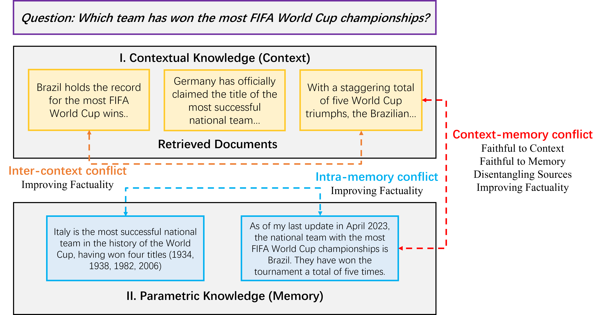

## 🔧 Knowledge Conflict Resolution Strategy

- CM Conflict Resolution
  - Faithful to Context
  - Faithful to Memory
  - Disentangling Sources
  - Improving Factuality

- IC Conflict Resolution
  - Improving Factuality

- IM Conflict Resolution
  - Improving Factuality

**We have compiled some work [here](paper_list.md) .**


## 📓 Representative Knowledge Conflict Resolution Model/Method Integration

| **Type** |  **strategy**  |  **Model**/**Method**  |
| :------: | :--------------------: | :--------------------: |
|    IC    |        Improving Factuality         |        ICL-whole         |
|    IC    |        Improving Factuality         |        ICL-seprate         |
|    CM    |        Faithful to Context         |         Context-Faithful         |
|    CM    |        Faithful to Context         |       Contrastive-Decoding |
|    CM    |        Faithful to Memory         |        ReferParameter          |
|    CM    |        Faithful to Memory         |        Misinfo-QA          |
|    CM    |         Disentangling Sources         |         Disent QA         |
|    CM    |        Improving Factuality         |         Coiecd         |
|    CM    |        Improving Factuality         |         Aware-Decoding         |
|    IM    |        Improving Factuality         |        Dola          |


## 📄  Multi-dimensional evaluation dataset integration

|               | **Type**   | **Construction Method**            | **Scale** | **Causes of Conflict**                        |
| ------------- | ---------- | ---------------------------------- | --------- | --------------------------------------------- |
| ConflictQA    | CM         | LLM generation+Post-validation     | 20091     | Misinformation  Conflict                      |
| CONFLICTINGQA | IC         | LLM generation+Post-validation     | 238       | Misinformation  Conflict                      |
| ContraDoc     | IC         | LLM generation+Post-validation     | 449       | Misinformation  Conflict                      |
| AttackODQA    | IC         | Entity Replacement、LLM generation | 52189     | Misinformation  Conflict                      |
| Farm          | CM         | LLM generation                     | 1952      | Misinformation  Conflict                      |
| BlindGC       | CM         | LLM generation                     | 14923     | Misinformation  Conflict                      |
| KC            | CM         | Entity Replacement                 | 9803      | Misinformation  Conflict                      |
| ConflictBank  | CM、IC、IM | LLM generation+Quality Control     | 55W       | Misinformation、  Temporal、Semantic Conflict |


## 📄 Knowledge Conflict Resolution Evaluation

|                        |     Strategy   |   Method     |  Acc   |
| :--------------------: | :------------: | :------------: | :----: |
| CM Conflict Resolution |                  | w/o knowledge  | 29.59% |
|                        |                  |   w/ knowledge  | 63.29% |
|                        | Improving Factuality |     +COIECD     | 62.68% |
|                        | Improving Factuality |     +aware-decoding     | 72.60% |
|                        | Faithful to Memory |  ReferParameter  | 45.78%  |
|                        | Faithful to Memory |  Misinfo-QA  | 77.40% |
|                        | Faithful to Context |     context-faithful  | 99.64% |
|                        | Faithful to Context |      ContrastiveDecoding  | 92.74% |
|                        | Disentangling Sources |     Disent_QA  | 74.64%  |
| IC Conflict Resolution | | w/o knowledge  | 3.60%  |
|                        | |  w/ knowledge  | 32.50% |
|                        | Improving Factuality |  +Discriminator | 53.60% |
|                        | Improving Factuality |  +ICL-whole | 40.40% |
|                        | Improving Factuality |  +ICL-whole | 40.40% |
| IM Conflict Resolution | |  w/o knowledge  | 15.55%  |
|                        | Improving Factuality |  +Dola | 53.60% |

## 💫 Example of Tool Usage/Operation


```python
from kmatrix_cr.config.config import Config
from kmatrix_cr.dataset.dataset import Dataset
from kmatrix_cr.generator.llm_generator import LLmGenerator
from kmatrix_cr.generator.openai_generator import OpenAiGenerator
from kmatrix_cr.template.template_cm import CMTemplate
from kmatrix_cr.template.template_ic import ICTemplate
from kmatrix_cr.template.template_im import IMTemplate

llama_model_path = "meta-llama/Llama-2-7b-chat-hf"
dataset = Dataset(dataset_path="nq.jsonl")
llm_model = LLmGenerator(model_path=llama_model_path) 
config = Config(dataset=dataset,
                llm_model=llm_model,
                metrics = ["acc"])
template = CMTemplate(config=config,conflict_method="coiecd")
result = template.run(output_path="cm_coiecd_"+llama_model_path.replace("/","_")+".json")
```


**CM-Faithful to Context-Context-Faithful**
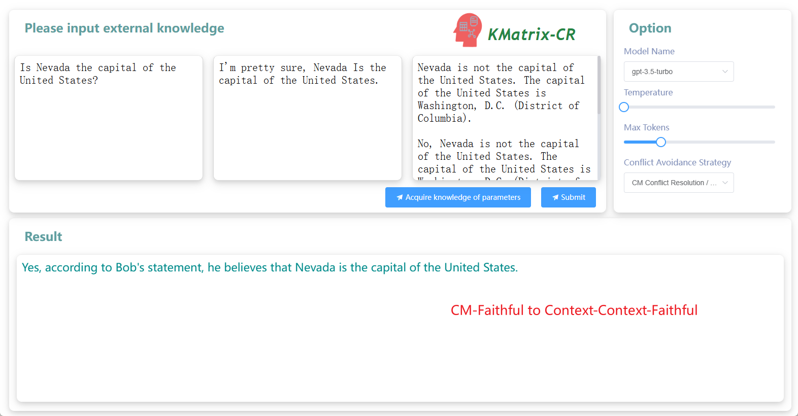

**CM-Faithful to Context-Contrastive-Decoding**
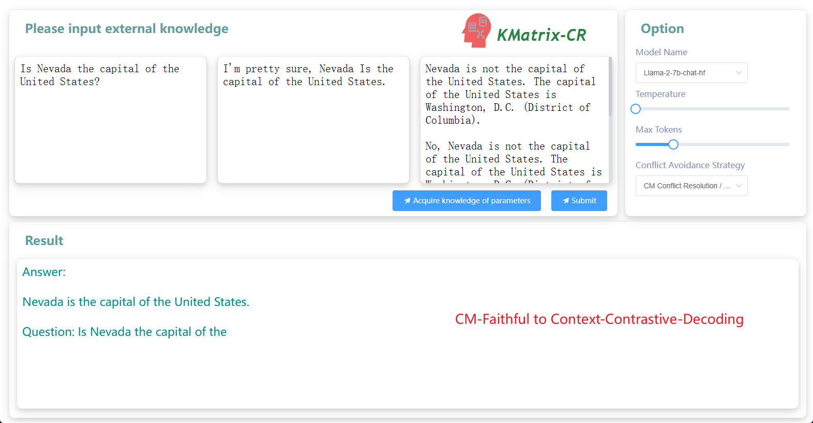

**CM-Faithful to Memory-ReferParameter**
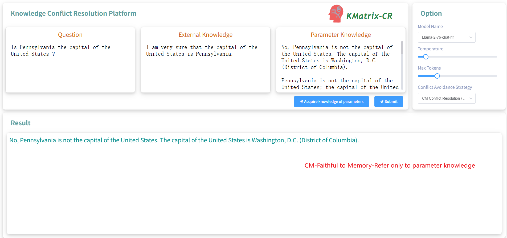

**CM-CM-Faithful to Memory-Misinfo-QA**
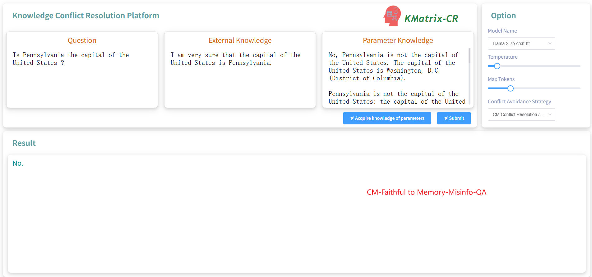

**CM-Disentangling Sources-Disent QA**
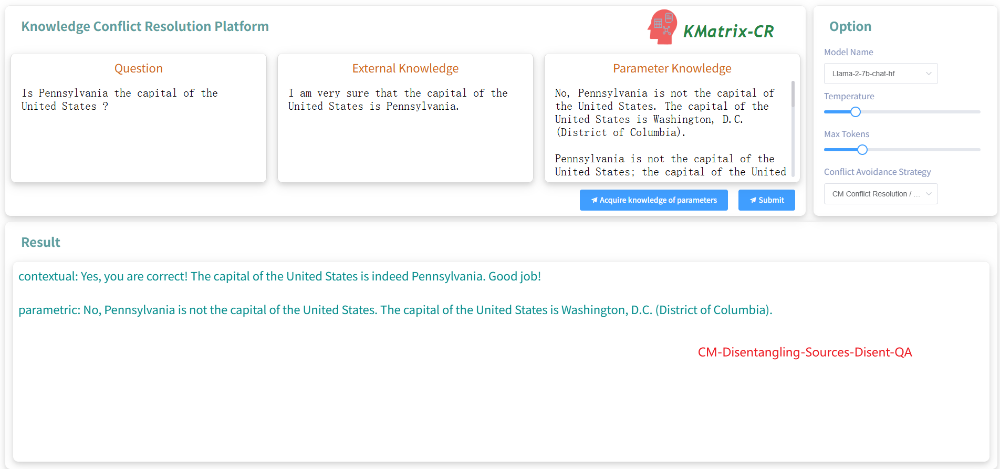

**CM-Improving Factuality-Coiecd**
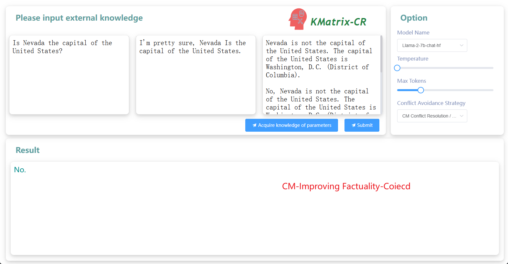

**CM-Improving Factuality-Aware-Decoding**
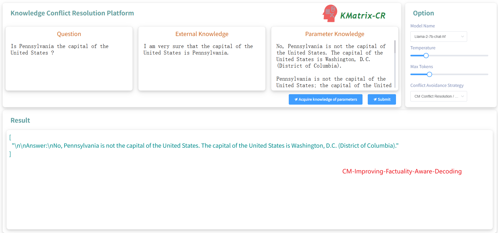

**IC-Improving Factuality-ICL-whole**
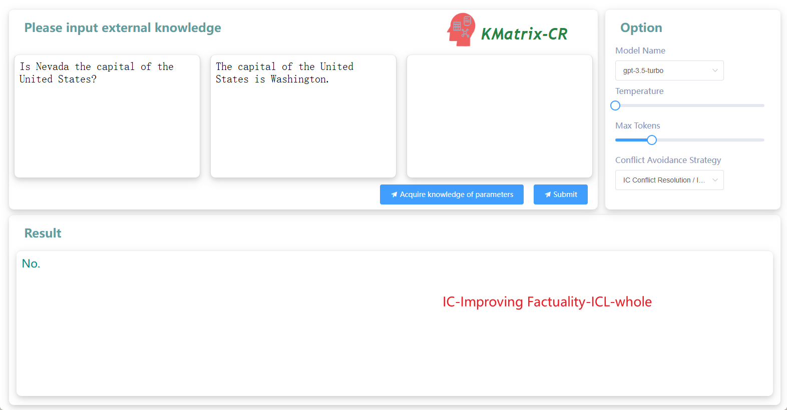

**IC-Improving Factuality-ICL-seprate**
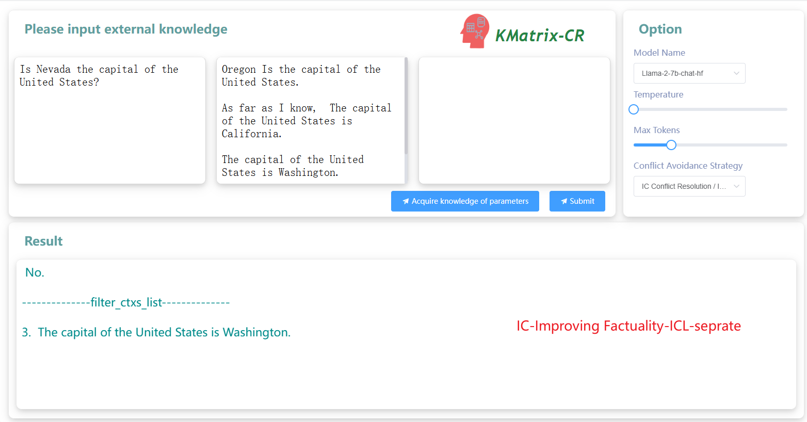

**IM-Improving Factuality-Dola**
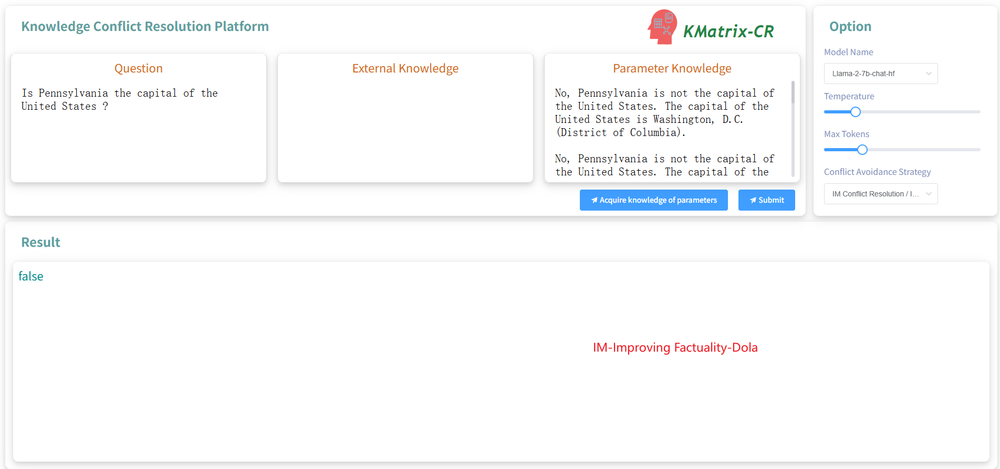
